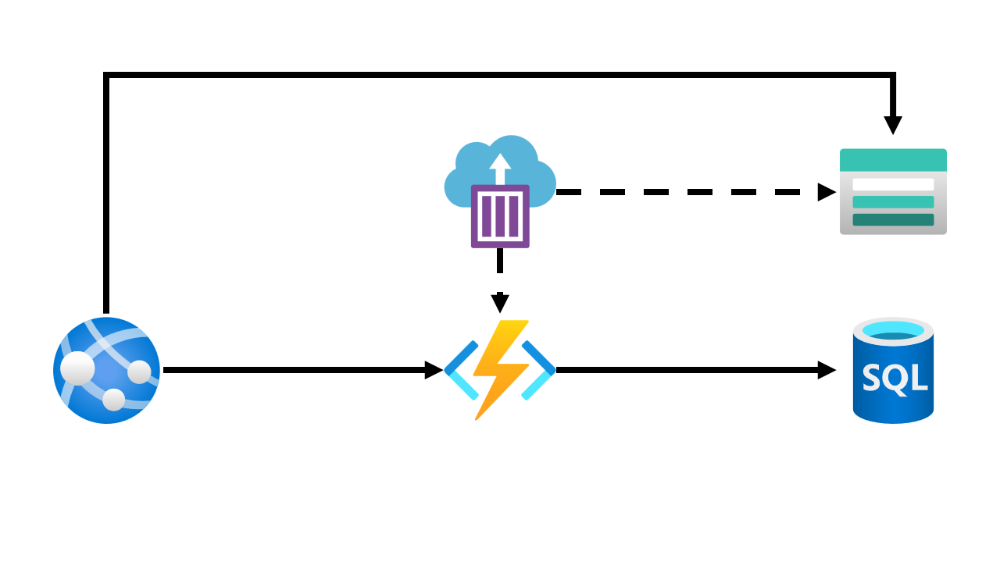

# The Azure Cosmos DB Workshop

## Overview

Welcome to the Azure Cosmos DB hands-on workshop! Throughout this workshop, you will go through tasks to take a reasonably modern web application, migrate it to [Azure Cosmos DB](https://azure.microsoft.com/services/cosmos-db/), and implement features to make the application better than ever.

After you are done with the workshop, you can continue to use the content available in our [GitHub repository](https://github.com/msusdev/cosmosdb_app_modernization) to learn about Azure Cosmos DB at your own pace.

> [Schedule](.\schedule\readme.md)

## Goals

In this workshop, you will be asked to:

- Migrate a small dataset from Azure SQL Database to Azure Cosmos DB.
- Write code in Azure Functions to query Azure Cosmos DB.
- Globally distribute your Azure Cosmos DB account to multiple Azure regions.
- Extend the SQL query grammar using a user-defined function (UDF).
- Use Jupyter Notebooks to create a simple dashboard for your database and containers.

## Challenge 01: Deploy the existing application stack

### Step A: Deploy with an ARM template

For your first challenge, you will take the existing application stack and deploy it to your Azure subscription.

The application stack consists of the following components:

- Azure Web App hosting the application website
  - The application code is deployed using the [msusdev/contoso.spaces.web](https://hub.docker.com/r/msusdev/contoso.spaces.web) container.
- Azure Functions to host the back-end APIs that power the application
  - ❗ Any code you modify in this workshop will only happen here.
  - This function app has the [msusdev/contoso.spaces.api](https://hub.docker.com/r/msusdev/contoso.spaces.api) container deployed by default.
- Azure SQL Database and Server for the application data.
- Azure Storage account to host the images used on the website and Azure Functions metadata
- Azure Container Instance to populate the Azure SQL Database and Azure Storage accounts with sample data
  - The [msusdev/contoso.spaces.populate](https://hub.docker.com/r/msusdev/contoso.spaces.populate) container is deployed to the container group.

Fortunately, you can deploy the application to your Azure subscription using an ARM template:

The deployment should take about **10 minutes**.

While the template is deploying, you should check out some of the deployment details from the Azure Resource Manager (ARM) template:

- The username and password for the SQL database are stored as variables in the template: [armdeploy.json#12](https://github.com/MSUSDEV/cosmosdb_app_modernization/blob/fb8685af8a93301801d9f612b35c9dd791de2d79/armdeploy.json#L12)
- The template also contains variables that points to the Docker container images on [Docker Hub](https://hub.docker.com/r/msusdev): [armdeploy.json#14](https://github.com/MSUSDEV/cosmosdb_app_modernization/blob/fb8685af8a93301801d9f612b35c9dd791de2d79/armdeploy.json#L14)
- The template deploys an Azure Container Instance to seed the Azure Storage and Azure Cosmos DB accounts with data: [armdeploy.json#105](https://github.com/MSUSDEV/cosmosdb_app_modernization/blob/fb8685af8a93301801d9f612b35c9dd791de2d79/armdeploy.json#L105)
- The Azure Function created by the template has a connection string to the SQL Database: [armdeploy.json#146](https://github.com/MSUSDEV/cosmosdb_app_modernization/blob/fb8685af8a93301801d9f612b35c9dd791de2d79/armdeploy.json#L146)
- The Azure Web App created by the template has multiple configuration settings to point to HTTP APIs hosted on Azure Functions: [armdeploy.json#207](https://github.com/MSUSDEV/cosmosdb_app_modernization/blob/fb8685af8a93301801d9f612b35c9dd791de2d79/armdeploy.json#L207)

### Validation: Review the deployment

1. Browse to the URL for the Azure Web App created by the ARM template deployment. If you have deployed the website successfully, you should see the following homepage:

> [Hints](./hints/01-deploy/)

## Challenge 02: Migrate data from Azure SQL Database to Azure Cosmos DB

For the first "real" challenge in this workshop, we will migrate our existing data from Azure SQL Database to Azure Cosmos DB.

❗ Remember, we are only migrating at this point. We are not changing our code or deleting our existing Azure SQL Database instance.

Since our application is read-only, this opens up a lot of possible avenues to move our data from the existing SQL database to a container in Azure Cosmos DB.

### Step A: Identify the existing database data

The data in Azure SQL Database consists of two simple tables with a predictable relationship:

At this point, you should query the Azure SQL Database instance using a tool of your choice and become familiar with the data set.

Next, you should create a map of the data from SQL to JSON formats.

### Step B: Create Azure Cosmos DB resources

It is a best practice to pre-configure your destination resources in Azure Cosmos DB prior to performing your migration.

At this point, you should plan and excute to creation of your Azure Cosmos DB **account**, **database**, and **container**.

### Step C: Perform migration

Now, it's time to perform the migration. There's no need to deal with the complexity of a live/online migration, you can use any tool or manual script you'd like.

### Validation: Plan and execute deployment

1. You should have a plan detailed on how you will perform the migration and how Azure Cosmos DB JSON documents will map to Azure SQL Database records
1. You should have performed the migration. You can verify that your deployment is successful by issuing a query to your new account, database, and container in Azure Cosmos DB. You can use the ``SELECT * FROM locations`` query to test your migration.

> [Hints](./hints/02-migrate/)

> [Solution](./solutions/02-migrate/)
